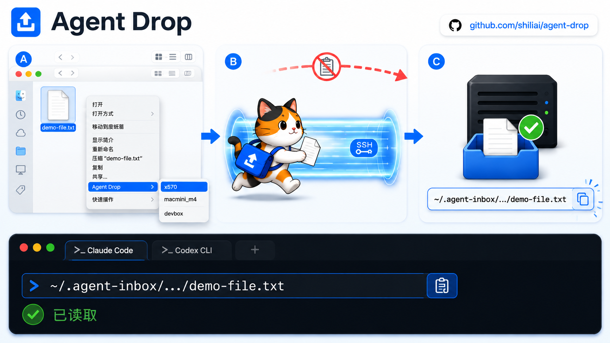
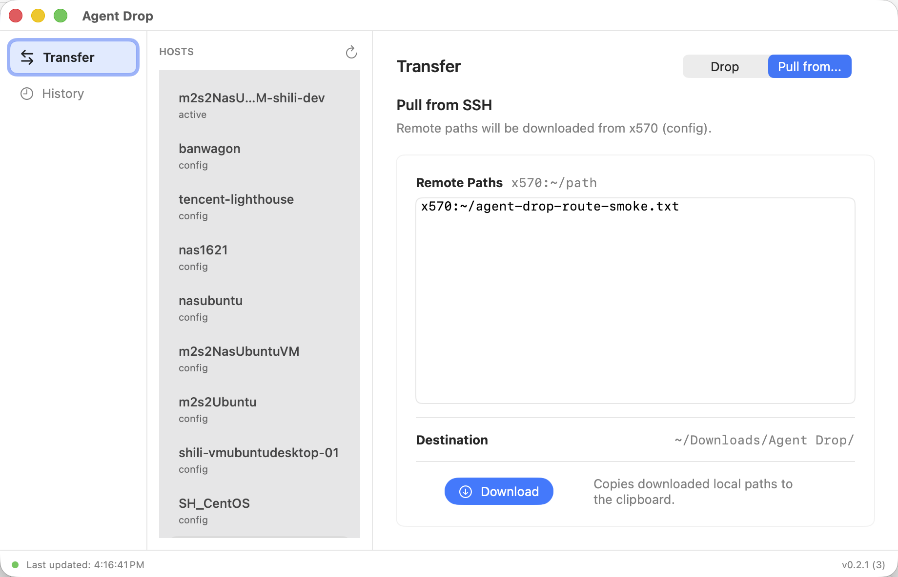

# Agent Drop

[简体中文](README.zh-CN.md)

Agent Drop is built for a common remote-agent development setup: you work on a Mac, SSH into a remote development machine, and run Codex, Claude Code, or another coding agent there.

When the remote agent needs a local screenshot, PDF, spec, fixture, or folder from your Mac, Agent Drop sends it to the SSH machine and gives you stable remote paths that can be pasted directly into the existing terminal session.



The first workflow sends local files and folders to a remote inbox:

```text
Right-click selected file(s) or folder(s)
  Agent Drop
    devbox
    gpu-box
    work-ubuntu
```

After a target is selected, Agent Drop uploads the selected files and folders to the remote machine and copies the final remote paths to the Mac clipboard.

```text
~/.agent-inbox/2026-06-15/demo.png
~/.agent-inbox/2026-06-15/spec-2.pdf
~/.agent-inbox/2026-06-15/project-folder
```

You can then paste those paths into the SSH terminal where Codex, Claude Code, or another coding agent is already running.

Agent Drop can also pull known remote files or folders back to the Mac. Use
`Agent Drop -> Pull from...` or the CLI, paste paths such as
`~/runs/output.png`, `/tmp/build-artifacts`, or `devbox:~/runs/output.png`,
and downloaded items land in `~/Downloads/Agent Drop/`. On success, the final
local paths are copied to the Mac clipboard.

## Screenshots

Transfer window with shared Hosts, Drop/Pull modes, and the global status bar:



## V1 Goals

- Run on macOS.
- Support Finder right-click delivery for selected files and folders.
- Show discovered SSH targets under an `Agent Drop` submenu.
- Discover targets from `~/.ssh/config` and active SSH connections.
- Upload through standard `ssh` and `rsync`.
- Store uploaded files and folders under the remote inbox root `~/.agent-inbox`.
- Group uploaded paths by date: `~/.agent-inbox/YYYY-MM-DD/`.
- Pull remote files and folders back into `~/Downloads/Agent Drop/`.
- Avoid overwrites by renaming conflicts, for example `demo-2.png` or
  `build-artifacts-2`.
- Copy final remote paths, including filenames or folder names, to the Mac clipboard.
- Copy final local paths after successful pulls.
- Check required local tools before Finder uploads and app pulls, then show
  setup feedback without installing dependencies automatically.

## CLI Usage

Agent Drop includes a CLI for checking dependencies, listing SSH targets,
sending files or folders, and pulling remote paths back to the Mac:

```bash
agent-drop targets
agent-drop doctor
agent-drop send --target <target> <paths...>
agent-drop pull --target <target> <remote-paths...>
```

Examples:

```bash
agent-drop send --target devbox ./demo.png ./project-folder
agent-drop pull --target devbox ~/runs/output.png /tmp/build-artifacts
agent-drop pull --target devbox devbox:~/runs/output.png
```

The CLI does not implement an interactive target picker. If exactly one SSH
target is discovered, `send` and `pull` can use it when `--target` is omitted.

`doctor`, Finder uploads, and app pulls check required local tools such as
`ssh`, `rsync`, `tar`, and `pbcopy`. Agent Drop reports missing tools clearly,
but it never installs dependencies automatically.

## Not In V1

- No prompt generation.
- No continuous bidirectional sync.
- No remote project directory integration.
- No clipboard image or clipboard text upload.
- No Raycast, Alfred, iOS sharing, or menu bar workflow.

## Design

The current V1 design is documented in:

[docs/superpowers/specs/2026-06-15-agent-drop-design.md](docs/superpowers/specs/2026-06-15-agent-drop-design.md)

The pull workflow design is documented in:

[docs/superpowers/specs/2026-06-26-agent-drop-pull-design.md](docs/superpowers/specs/2026-06-26-agent-drop-pull-design.md)

The transfer navigation design is documented in:

[docs/superpowers/specs/2026-06-27-agent-drop-transfer-navigation-design.md](docs/superpowers/specs/2026-06-27-agent-drop-transfer-navigation-design.md)

## Development

Run the core tests:

```bash
swift test
```

Generate the Xcode project:

```bash
xcodegen generate
```

Build the app and Finder Sync extension without signing checks:

```bash
xcodebuild -project AgentDrop.xcodeproj -scheme AgentDrop -configuration Debug build CODE_SIGNING_ALLOWED=NO
```

For local Finder Sync testing, use Xcode automatic signing with an Apple
Development certificate. Both the app target and Finder Sync extension target
should use the same Team. The checked-in `project.yml` contains the development
team and entitlements used for this local flow.

Build a signed Debug app:

```bash
xcodebuild -project AgentDrop.xcodeproj -scheme AgentDrop -configuration Debug build
```

Package a developer DMG for release testing:

```bash
scripts/package_developer_dmg.sh
```

The DMG is written to `dist/AgentDrop-developer.dmg`. Open it, then drag
`Agent Drop.app` into `Applications`.

This is a developer build, not a notarized public release. On first launch,
macOS may require allowing the app in Privacy & Security. The Finder extension
still needs to be enabled in System Settings > Login Items & Extensions >
Extensions, followed by a Finder restart if the right-click menu does not appear.

Install the signed app locally:

```bash
APP_SRC="$(find "$HOME/Library/Developer/Xcode/DerivedData" -path "*/AgentDrop-*/Build/Products/Debug/AgentDrop.app" -type d | sort | tail -n 1)"
APP_DEST="$HOME/Applications/Agent Drop.app"

test -n "$APP_SRC"
pkill -x AgentDrop || true
pkill -x AgentDropFinderSync || true
rm -rf "$APP_DEST"
/usr/bin/ditto "$APP_SRC" "$APP_DEST"
/System/Library/Frameworks/CoreServices.framework/Frameworks/LaunchServices.framework/Support/lsregister -f -R -trusted "$APP_DEST"
xcrun pluginkit -a "$APP_DEST/Contents/PlugIns/AgentDropFinderSync.appex" || true
xcrun pluginkit -e use -i ai.shili.AgentDrop.FinderSync || true
open -n "$APP_DEST"
killall Finder
```

If the right-click menu is not visible, open System Settings > Login Items &
Extensions > Extensions and enable the Agent Drop Finder extension. Restart
Finder after changing the extension state.

Run the CLI during development:

```bash
swift run agent-drop doctor
swift run agent-drop targets
swift run agent-drop send --target devbox ./demo.png ./project-folder
swift run agent-drop pull --target devbox ~/runs/output.png
```

Agent Drop uses a UTC `YYYY-MM-DD` folder for uploaded file paths.

Regular files and directories are supported. Directory uploads preserve the
selected directory contents under a remote directory with the same display name.
Pulls place files and directories under `~/Downloads/Agent Drop/`, preserving
directory contents and choosing a suffixed name if the local destination exists.

## Finder Extension Notes

- The Finder menu is `Agent Drop -> <SSH target>` for uploads.
- `Agent Drop -> Pull from...` opens the app's `Transfer` section in Pull mode
  through `agentdrop://pull`.
- The root menu item includes a small template upload icon.
- On upload success or failure, Finder badges the selected file briefly.
- While a Finder upload is running, the extension writes a live history row so
  the app can show the active upload in the global status bar from any section.
- The extension writes diagnostics to
  `~/Library/Containers/ai.shili.AgentDrop.FinderSync/Data/Library/Logs/AgentDropFinderSync.log`.
- macOS notification delivery from Finder Sync is best-effort. The app's
  `History` section is the reliable feedback and history surface.

## Transfer History

Agent Drop records recent uploads and downloads in the Finder extension
container:

    ~/Library/Containers/ai.shili.AgentDrop.FinderSync/Data/Library/Application Support/Agent Drop/upload-history.json

The app reads that file to show `History`. Selecting a successful
upload copies remote paths again; selecting a successful download copies local
paths again. Failed rows include a short error and do not have a copy payload.
Finder uploads first appear as `Uploading` rows, then update in place to success
or failure. If the app finds an old unfinished Finder upload, it shows the row
as status unknown instead of leaving the status bar active forever.
The bottom status bar shows the refresh status dot, the last history refresh
time, and the app version/build. The JSON file name is kept for compatibility
even though it now stores both transfer directions.

For this developer build path, the containing app is intentionally
unsandboxed so it can read the Finder extension history file without requiring
an Apple Developer Program App Group. A later signed and notarized release can
migrate the store to an App Group container.

Manual Finder smoke test:

```bash
TEST_FILE="$HOME/Downloads/agent-drop-ui-test.png"
printf 'Agent Drop Finder smoke test\n' > "$TEST_FILE"
printf 'AGENT_DROP_PENDING' | pbcopy
open -R "$TEST_FILE"
```

Then right-click the file or a test folder in Finder, choose
`Agent Drop -> x570 config` or another configured target, and verify:

```bash
pbpaste
ssh x570 'd="$HOME/.agent-inbox/$(date +%F)"; ls -l "$d"/agent-drop-ui-test*; wc -c "$d"/agent-drop-ui-test*'
tail -n 80 "$HOME/Library/Containers/ai.shili.AgentDrop.FinderSync/Data/Library/Logs/AgentDropFinderSync.log"
```

Expected: `pbpaste` contains the final remote path, the remote file or folder
exists, directory uploads preserve their contents, and the diagnostic log
records `upload success`. If `Agent Drop.app` is open during the upload, the
global status bar shows the active upload from any section and `History` shows
an `Uploading` row that updates to success or failure.

After a Finder upload, verify history was written:

    HISTORY="$HOME/Library/Containers/ai.shili.AgentDrop.FinderSync/Data/Library/Application Support/Agent Drop/upload-history.json"
    test -f "$HISTORY"
    python3 -m json.tool "$HISTORY" | sed -n '1,80p'

Open `Agent Drop.app` and confirm the upload appears in `History`.
Select the upload, reset the clipboard, click `Copy Paths`, and verify
`pbpaste` no longer shows the placeholder but the remote path:

    printf 'APP_COPY_PENDING' | pbcopy
    pbpaste

Manual pull smoke test with `x570`:

```bash
TEST_FILE="$TMPDIR/agent-drop-e2e-$(date -u +%Y%m%dT%H%M%SZ).txt"
printf 'Agent Drop x570 pull smoke test\n' > "$TEST_FILE"
REMOTE_PATH="$(swift run agent-drop send --target x570 "$TEST_FILE" | tail -n 1)"
LOCAL_PATH="$(swift run agent-drop pull --target x570 "$REMOTE_PATH" | tail -n 1)"
test -f "$LOCAL_PATH"
cmp "$TEST_FILE" "$LOCAL_PATH"
test "$(pbpaste)" = "$LOCAL_PATH"
```

For a directory round trip, send and pull a small folder and compare its files:

```bash
TEST_DIR="$TMPDIR/agent-drop-e2e-dir-$(date -u +%Y%m%dT%H%M%SZ)"
mkdir -p "$TEST_DIR/nested"
printf 'root\n' > "$TEST_DIR/root.txt"
printf 'nested\n' > "$TEST_DIR/nested/child.txt"
REMOTE_DIR="$(swift run agent-drop send --target x570 "$TEST_DIR" | tail -n 1)"
LOCAL_DIR="$(swift run agent-drop pull --target x570 "$REMOTE_DIR" | tail -n 1)"
cmp "$TEST_DIR/root.txt" "$LOCAL_DIR/root.txt"
cmp "$TEST_DIR/nested/child.txt" "$LOCAL_DIR/nested/child.txt"
```

Repeat the pull command with the same remote path to confirm local conflicts use
the `-2` suffix. To test the App route, copy `x570:$REMOTE_PATH`, choose
`Agent Drop -> Pull from...` in Finder, and confirm the `Transfer` section opens
in Pull mode, preselects `x570`, and preloads the host-prefixed remote path.

## Status

Agent Drop V1 is implemented. The repository includes the Swift package/core, CLI, macOS app, Finder Sync extension, upload and pull workflows, core tests, XcodeGen project configuration, and documented local test/build workflow.
